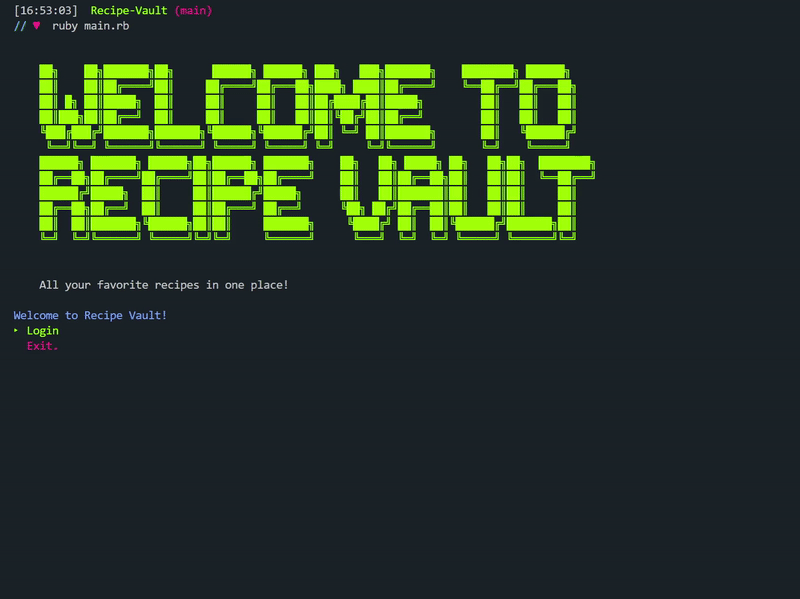

# Recipe Vault

Recipe Vault is a lightweight CLI application that allows users to create, save and share their favorite food recipes.



## Installing

1. Install dependencies

   ```bash
   bundle install
   ```

2. Seed the database

   ```bash
   rake db:migrate && rake db:seed
   ```

3. Start the program

   ```bash
   ruby main.rb
   ```

## Built with

- [Ruby](https://www.ruby-lang.org/en/)
- [TTY::Prompt](https://github.com/piotrmurach/tty-prompt/)
- [Recipe API](https://github.com/tabatkins/recipe-db)
